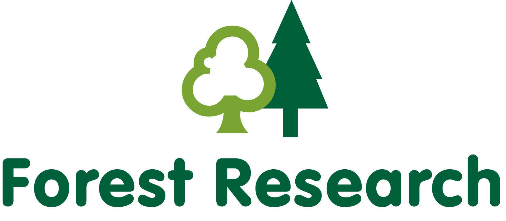
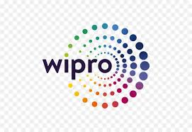

<!-- Navigation Bar -->
<nav style="position: sticky; top: 0; background-color: #ffffff; padding: 12px 20px; font-family: sans-serif; font-size: 16px; z-index: 999; border-bottom: 1px solid #ccc; white-space: nowrap; overflow-x: auto; display: flex; min-width: 100%;">
  <a href="#education" style="margin-right: 20px; text-decoration: none; font-weight: bold; color: #333;">Education</a>
  <a href="#experience" style="margin-right: 20px; text-decoration: none; font-weight: bold; color: #333;">Experience</a>
  <a href="#projects" style="margin-right: 20px; text-decoration: none; font-weight: bold; color: #333;">Projects</a>
  <a href="#skills" style="margin-right: 20px; text-decoration: none; font-weight: bold; color: #333;">Skills</a>
  <a href="#contact" style="margin-right: 20px; text-decoration: none; font-weight: bold; color: #333;">Contact</a>
  <a href="/assets/resume/Irfan_Resume.pdf" download style="text-decoration: none; font-weight: bold; color: #333;">Resume</a>
</nav>

<!-- CSS -->

---

## Education

- **The University of Edinburgh, Edinburgh, UK**  
  *MSc in Artificial Intelligence (Sep 2023 – Nov 2024)*
- **Vellore Institute of Technology (VIT), Vellore, India**  
  *BTech in Electrical and Electronics Engineering (Jun 2017 – Jun 2021)*

---

## Experience

- **Forest Research (The research agency of the Forestry Commission, UK government), Northern Research Station, Edinburgh, UK**  
  *Student Researcher – March 2024 to August 2024*  
  
  

View Details
 
  <ul>
    <li>Conducted an industry-partnered machine learning research with Forest Research (the research agency of the Forestry Commission, UK government) for my MSc dissertation, focusing on the classification of tree species in the Forest of Dean using high-resolution multispectral satellite imagery from Planet Labs’ SuperDove 8 satellites.</li>
    <li>Implemented and trained deep learning models, including ResNet-34, DenseNet-40 and Vision Transformers (ViT) to perform species classification. Utilized QGIS for geospatial preprocessing, spatial analysis, and visualization of labelled tree data.</li>
    <li>Performed a comparative evaluation of the models and analyzed classification accuracy across various tree species. Additionally, examined species spectral curves to understand and explain model predictions, highlighting the strengths and limitations in classification performance, contributing to advancements in precise forestry and remote sensing applications.</li>
  </ul>
  

- **Wipro Limited, Chennai, India**  
  *SAP BW Consultant – July 2021 to June 2023*  
  
  

View Details
 
  <ul>
    <li>Designed and optimized SAP BW process chains for the client, Nomad Foods Europe Limited, leading to improved automation and data integration. Enhanced data loading efficiency and reduced manual intervention by developing models using Advanced DataStore Objects (aDSO) and composite providers, ensuring timely and reliable data availability.</li>
    <li>Developed customized SAP BW queries to meet Nomad Foods' reporting needs, resulting in more accurate, actionable insights. Enabled real-time data analysis for critical decisions by transforming and modeling data to align with business KPIs.</li>
    <li>Implemented SAP BW/4HANA data provisioning and ETL processes, ensuring faster and more reliable data acquisition. Enhanced BI report performance, supporting the client's operational and strategic planning with accurate, timely data flows.</li>
  </ul>
  

---

## Projects

- **Deep Learning Pipeline for Football Match Analysis**
   
  
  
  
   
  
  Models: YOLOv8, SigLIP | Techniques: UMAP, KMeans | Libraries: Ultralytics, Roboflow, OpenCV, Transformers (Hugging Face), ByteTrack, NumPy, PyTorch | Language: Python
  
  

View Details
 
  <ul>
    <li>Developed a full deep learning pipeline to analyze professional football match footage using video data provided in the DFL Bundesliga Data Shootout competition on Kaggle.</li>
    <li>Fine-tuned two YOLOv8 models:
      <ul>
        <li>One for object detection (players, goalkeepers, referees, ball)</li>
        <li>Another for keypoint detection (32 characteristic points on the football pitch)</li>
      </ul>
    </li>
    <li>Used ByteTrack for robust multi-object tracking to assign consistent IDs to players and referees across frames.</li>
    <li>Built a team classification module using SigLIP for visual embeddings, UMAP for dimensionality reduction, and KMeans clustering to group players into two teams.</li>
    <li>Applied two forms of perspective transformation using pitch keypoints:
      <ul>
        <li>Line Projection (Pitch → Frame): Overlayed accurate virtual lines (e.g., center line, penalty box) on the broadcast video.</li>
        <li>Player Projection (Frame → Pitch): Mapped player and ball positions to a top-down radar-style pitch view for tactical analysis.</li>
      </ul>
    </li>
    <li>Visualized Voronoi diagrams based on player positions to illustrate spatial control and team dominance on the field.</li>
  </ul>
  

- **LLM Character-Based Chatbot using LLaMA 2**
   
  
  
   
  
  Models: LLaMA 2 | Techniques: LoRA, Quantization | Libraries: Transformers (Hugging Face), Datasets (Hugging Face), PEFT, bitsandbytes, NumPy, PyTorch, Gradio | Language: Python
  
  

View Details
 
  <ul>
    <li>Fine-tuned Meta’s LLaMA-2-7b-chat-hf model to function as a character-based chatbot for personalized conversational interactions.</li>
    <li>Used LoRA (Low-Rank Adaptation) to fine-tune the model efficiently, and applied 4-bit quantization to reduce memory usage and improve inference performance.</li>
    <li>Published the trained model adapter and dataset to Hugging Face Hub for open access and experimentation.</li>
    <li>Built an interactive Gradio interface for real-time chatting with the character persona based language model.</li>
  </ul>
  

- **Non-Self-Referential Attention in Transformers**  
  
   
  
  Libraries: PyTorch, NumPy, Pandas, Datasets (Hugging Face), NLTK, Tokenizers (Hugging Face) | Language: Python
  
  

View Details
 
  <ul>
    <li>Explored modifications to Transformer architecture and developed a method called Non-Self-Referential Attention.</li>
    <li>Driven by the observation that self-attention values (main diagonal of the attention matrix) were often disproportionately high yet minimally informative, this method attenuated those values by a tunable factor to diversify attention distributions and improve performance on tasks like machine translation.</li>
    <li>Applied this approach to the 'en-pt' translation subset of the opus_books dataset, achieving a 2.12% BLEU score improvement.</li>
  </ul>
  

- **Retrieval-Augmented Generation (RAG) Pipeline for Textbook Search**  
  
   
  
  Models: Google GEMMA-7B-it | Techniques: RAG | Libraries: PyTorch, NumPy, Pandas, Transformers (Hugging Face) | Language: Python
  
  

View Details
 
  <ul>
    <li>Extracted and preprocessed text from PDF textbooks, formatted it into chunks and converted them into numerical embeddings.</li>
    <li>Designed a vector-based retrieval system to identify and extract relevant text chunks based on user queries.</li>
    <li>Generated context-aware prompts using retrieved passages and utilized LLM (Google/GEMMA-7B-it) to produce accurate, context-driven responses to queries derived from textbook content.</li>
  </ul>
  

- **Multi-Label Learning from Single Positive Labels**  
  
   
  
  Techniques: SPMLL | Libraries: PyTorch, NumPy, Pandas, scikit-learn | Language: Python
  
  

View Details
 
  <ul>
    <li>This project explores the challenge of multi-label classification in settings where each training example is annotated with only a single positive label, despite the presence of multiple applicable labels. In real-world scenarios, especially when the number of potential labels is large, it becomes impractical for human annotators to exhaustively list all relevant labels for each instance. This results in sparsely labeled data that is difficult to learn from using conventional techniques.</li>
    <li>A practical example of this problem arises in species distribution modeling (SDM), where the goal is to predict the presence or absence of species across geographic regions based on limited field observations. In such datasets, only the locations where a species has been observed are recorded, and absence information is typically unavailable, making the task more complex and imbalanced.</li>
    <li>A neural network was trained to perform accurate multi-label inference at test time, despite being exposed to only a single positive label per instance during training, a setting known as Single Positive Multi-Label Learning (SPMLL) where multiple correct labels exist but only one is observed per example.</li>
    <li>Introduced a custom loss function called UPL (Up-weighting Positive Label), which increases the contribution of observed labels while handling ambiguity in the unobserved ones.</li>
    <li>The UPL loss resulted in a 72% improvement in performance over standard binary cross-entropy loss across key evaluation metrics.</li>
  </ul>
  

- **Evaluating the Robustness of Classical ML vs Deep Learning**  
  
   
  
Models: AlexNet, Random Forest, SVM | Libraries: PyTorch, OpenCV, scikit-learn, NumPy, Pandas | Language: Python
  
 

View Details
 
  <ul>
    <li>Investigated the robustness of classical machine learning models compared to deep learning architectures when exposed to real-world variations in image quality.</li>
    <li>Random Forest and Support Vector Machine (SVM) were used as classical baselines, while AlexNet, a convolutional neural network, represented the deep learning approach.</li>
    <li>All models were trained on the clean version of the Sports Balls Multiclass Image Classification dataset from Kaggle, containing over 9,000 images across 15 sports ball categories.</li>
    <li>Robustness testing involved introducing controlled perturbations, including Gaussian noise, blurring, contrast and brightness shifts, occlusion, and salt-and-pepper noise.</li>
    <li>Results showed that classical models deteriorated significantly under noisy conditions, while AlexNet maintained a higher level of performance, demonstrating stronger generalization to distorted inputs.</li>
  </ul>
  

---

## Skills

- **Programming Languages & Databases:** Python, SQL, PostgreSQL, MongoDB  
- **Frameworks & Libraries:** PyTorch, NumPy, Pandas, scikit-learn, SQL, OpenCV, spaCy, NLTK, Transformers (Hugging Face), LlamaIndex  
- **Cloud Platforms & MLOps:** AWS, Docker, Git, GitHub Actions, DVC  
- **Machine Learning:** Deep Learning (Transformers, CNNs, RNNs, VAEs, GANs), Bayesian Inference, Supervised/Unsupervised Learning, Computer Vision, NLP, LLM Fine-Tuning (LoRA), Retrieval-Augmented Generation (RAG), LLM Compression

---

## Contact

📧 **irfanhamid19@gmail.com**  
📱 **+91 9789596664** | **+44 7471069088**  
[LinkedIn](https://www.linkedin.com/in/irfan-hamid/) • [GitHub](https://github.com/Irfan-Hamid)

